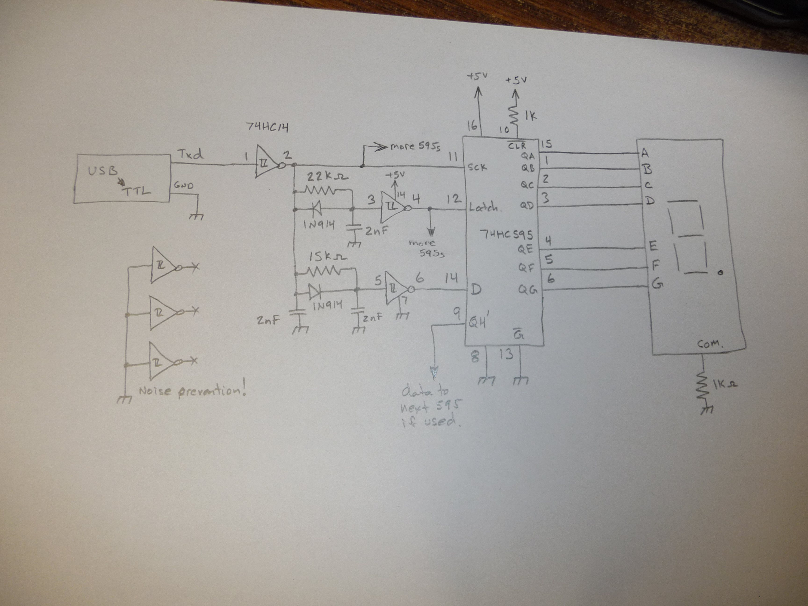
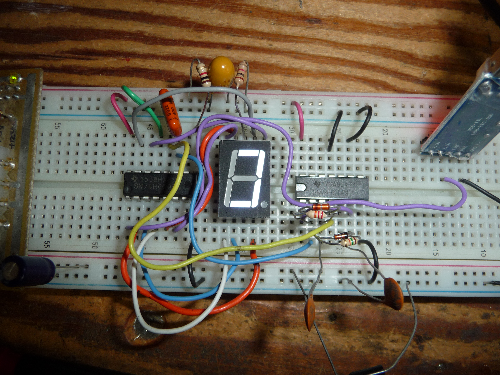
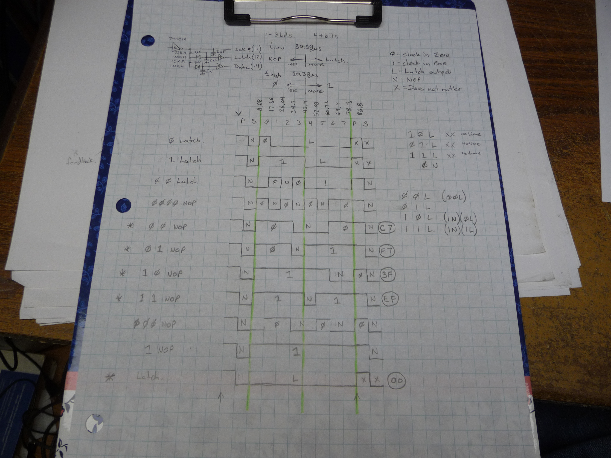

# 115kbaud serial to 595 adapter.

ah so cool, where do I start!?

This project operates a 74HC595 shift register from a normal serial port 
  using normal serial data. On the software end, the data is put thru a
  'modulator' function, and on the hardware end, there are two edge delay 
  circuits made of a 74HC14. no microcontroller is required. 
  As I present the project here, the 74HC595s can be chained (need
  40 outputs? chain 5 chips!) 
  The requirement is that there be no transmission delays between bytes
  in the serial stream (can your computer keep up with 115kbaud?)
  
  - The system can be modified to not use the 74HC14, but its difficult to
    get the timing right and the timing will change as chips are added.
  
  - Here I have used 115kbaud, but with a different RC combination, slower
    (or probably faster) speeds could be used. Based on the stability I 
    have seen with this, I think 115kbaud is close to the upper limit.
    If you are using a different baud rate, set the edge delay circuits
    to the middle value between 3 and 4 bit-times.
  
----  
# PWM

    I was asked if this could do PWM, well, kinda.
    115200bits/sec 10 bits/byte is 11520 bytes/sec
    11520 bytes/sec at 5 bytes/74595-load is 2304 loads/second
    2304 loads/sec at 32 updates/pwm cycle (5 bit pwm) leaves you with 72Hz PWM

so yes, for 5 bit PWM, it can do 72Hz.

----
# Hardware

  Its just a 74HC14, a few discrete components and the 74HC595s
  
  
  
  

----
# Demo

The demo code operates a single 7 segment digit

    Qa -> A
    Qb -> B
    Qc -> C
    Qd -> D
    Qe -> E
    Qf -> F
    Qg -> G

I have pre-generated binary files as required to display Jennys phone number.

----

# Compile

 This is compiled with gcc *.c -o genbin
   
 modify the call to convertByte for the data you want to load. The second
 paramiter is a flag to latch the data. 
 If you have 4 74595 chained, use 0 for the first three calls, and 1 for the 
 last call.
 
 example:
 
    convertByte(CG[5], 0);  // load 8 bits into the registers
    convertByte(CG[3], 0);  // load 8 more bits into the registers
    convertByte(CG[0], 0);  // load 8 more bits into the registers
    convertByte(CG[9], 1);  // load 8 more bits into the registers, and latch all the outputs

----
# Roll your own

Here is the chart I used to build the encoder. It may give you some clues if you want to 
make a modified system. I have only used the values with asterisks beside them in 
the code, as thats a complete set to generate any output.

----

I have tried to provide all the information you need to use this. 
Find and request clarification on all the things I'v accidently left out
ok?  

I can be found on twitter (@ruenahcmohr) 

or on the libera irc network, in #robotics ( https://web.libera.chat/?channel=#robotics )

